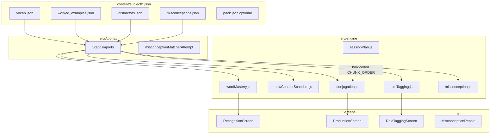
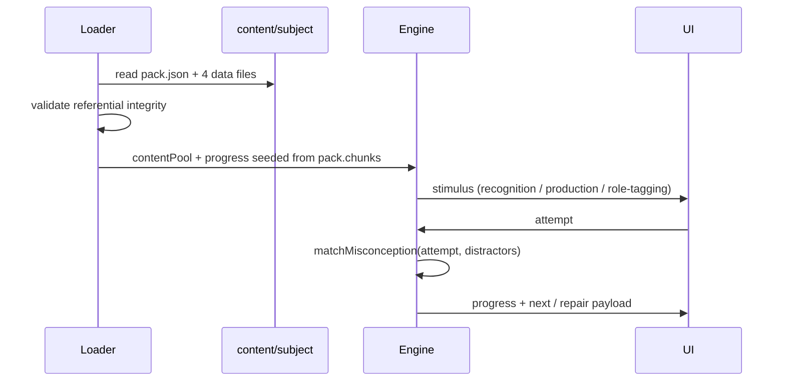

# Subject Content Pack Interface

> **Status:** July 2026 design document, superseded by the subject contract in
> [`src/subjects/README.md`](../src/subjects/README.md). Kept for history; it does not
> describe the current code.

| Field | Value |
|---|---|
| **Title** | Subject Content Pack Interface |
| **Author** | design-doc-writer |
| **Date** | 2026-07-22 |
| **Status** | Draft |
| **Audience** | Engineers extending the pedagogy engine beyond Spanish |
| **Related** | [`SPEC.md`](../SPEC.md), [`README.md`](../README.md), [`docs/generalization-audit.md`](./generalization-audit.md), [`docs/second-subject-candidates.md`](./second-subject-candidates.md) |

---

## Overview

The learning app ships a single proof subject under `content/spanish/`: four static JSON files (vocab, distractors, misconceptions, worked examples). The pedagogy engine is *intended* to be subject-agnostic (chunking, I-do/We-do/You-do, named-misconception repair, calendar review), but today the **content shape and several engine modules assume Spanish regular present-tense conjugation**.

This document defines the **Subject Content Pack**: the directory layout, file-level JSON contracts, and field classifications a second subject must satisfy to feed the existing pedagogy mechanics. It is a **content contract / interface design**, not a full multi-subject product plan. Implementation of multi-subject loading is sketched only in the PR Plan.

**Honest coupling constraint:** a non-isomorphic subject (SQL, math, bookkeeping) cannot plug into the current binary with *zero* code changes. Several modules hardcode Spanish chunk IDs (`ar`/`er`/`ir`), grammatical persons, stem-suffix rules, and role labels (see [Engine Coupling Points](#engine-coupling-points)). The pack contract standardizes authoring shape and referential integrity; **only manifest keys that a listed PR wires into the engine are live behavior** (see K9). Parameterization work in the PR Plan turns those keys into the single source of subject identity over time — not on docs merge alone.

---

## Background & Motivation

### Current state

Spanish content lives at:

```
content/spanish/
  vocab.json              # 82 items
  distractors.json        # 37 seeds
  misconceptions.json     # 18 catalog entries
  worked_examples.json    # 3 family paradigms
```

Loading is hardcoded in `src/App.jsx`:

```2:5:src/App.jsx
import vocab from '../content/spanish/vocab.json'
import workedExamples from '../content/spanish/worked_examples.json'
import distractors from '../content/spanish/distractors.json'
import misconceptions from '../content/spanish/misconceptions.json'
```

Progress defaults seed three Spanish chunks in `server/progressStore.js` (`ar`, `er`, `ir`). Session ordering hardcodes the same IDs in `src/engine/sessionPlan.js` (`CHUNK_ORDER`).

### Pain points

1. **No declared contract.** Content field meanings are implicit in engine consumers and tests; authors cannot know which fields are required vs decorative.
2. **Spanish names bleed into generic mechanics.** `pos: "verb"`, `family: "ar"`, `type: "false_cognate"` are treated as runtime filters, not just Spanish vocabulary.
3. **Second subject blocked.** [`docs/second-subject-candidates.md`](./second-subject-candidates.md) recommends Basic SQL as the next proof, but without a pack interface, content authoring and engine generalization cannot proceed in parallel.
4. **Unused fields confuse authors.** Worked examples carry `stem`, `steps_overview`, `verb_id`, `infinitive`, etc. that the runtime never reads (stem is recomputed via `stemOf`).

### Motivation

Document the real content surface the engine depends on, separate generic pedagogy fields from language/conjugation-specific ones, and provide a minimal second-subject pack (French regular present) that validates the contract against an isomorphic domain.

---

## Goals & Non-Goals

### Goals

1. Define the **required file set** and directory layout under `content/<subject_id>/`.
2. Specify a **field-level contract** (required vs optional, types, referential integrity) for each file, grounded in actual consumers under `src/engine/*` and UI screens.
3. Classify every field as **generic pedagogy**, **language-learning**, or **Spanish-only**, with guidance for omit / replace / remap.
4. Provide a **minimal valid second-subject pack** (French regular present) with sample JSON for each file.
5. Map engine coupling points so implementers know what must stay content-driven vs what still requires code generalization.

### Non-Goals

- Implementing multi-subject loading, subject switcher UI, or runtime pack validation code (docs only; PR Plan sketches later work).
- Changing any file under `content/spanish/`.
- Redesigning exercise types, review ladder intervals, or advancement gates.
- Building content-authoring tooling or CMS (out of scope per `SPEC.md` ticket 07).
- Fully specifying SQL / music / bookkeeping content (candidates are covered elsewhere; this pack interface must still *accommodate* them once engine hardcodes are parameterized).
- Progress-schema redesign beyond noting that default chunks must come from the pack.

---

## Key Decisions

| # | Decision | Rationale |
|---|---|---|
| K1 | Pack = four JSON data files + optional `pack.json` manifest | Matches existing Spanish layout (`SPEC.md` ticket 07 / README). Manifest is additive for multi-subject without rewriting Spanish content. |
| K2 | Keep Spanish field *names* as the v1 wire format | Engine and UI already read `word`, `meaning`, `family`, `endings`, etc. Renaming to abstract terms would force a big-bang migration; document **generic semantics** alongside Spanish names instead. |
| K3 | French regular present is the worked second-subject example | Closest isomorphic domain: families, stem+ending production, false cognates, overgeneralization. Proves the pack without inventing a new production model. SQL remains the recommended *product* second proof (`second-subject-candidates.md`) once production/roles are parameterized. |
| K4 | Classify fields into Generic / Language-learning / Spanish-presentation | Enables authors of non-language subjects to know what to remap (`family` -> chunk id, `person` -> production slot) vs what they may omit (`false_cognate` type if unused). |
| K5 | Required for engine behavior vs optional authoring aids | Only fields that affect stimulus generation, grading, or repair are **required**. Authoring-only fields (`note`, `steps_overview`, unused `stem`) are **optional** and ignored by runtime. |
| K6 | Pack must declare chunk order and production-slot keys (via `pack.json` target API) | Today these live in code (`CHUNK_ORDER`, `PERSONS`). The contract documents them as pack-owned so PR work can move them out of engine modules. |
| K7 | Do not require isomorphic Spanish chunk IDs (`ar`/`er`/`ir`) for new packs | New packs choose their own chunk ids; progress defaults and session order must load from the pack (or a temporary adapter). French uses `er`/`ir`/`re` (suffix-shaped so `strip_chunk_suffix` works; multi-subject isolation is via `subject_id`, not unique global chunk ids). |
| K8 | Distractor `type` *names* are data; v1 matcher implements only two fixed shapes | `matchMisconception` branches on two hard-coded shapes: `false_cognate` (`word_id`+`distractor`) and `overgeneralization` (`verb_id`+`person`+`distractor_form`). Callers choose which type string an attempt carries, but a **new** type string or field shape does not match until matcher code (and the attempt adapter in `App.jsx`) grow a new branch. Pack.json alone cannot invent shapes. See [Misconception matcher scope](#misconception-matcher-scope-v1). |
| K9 | v1 contract = authoring shape + referential integrity; live engine keys are an explicit subset | Authors may declare full `pack.json`, but runtime behavior only changes for keys a PR wires in. **Live after PR-3:** `chunk_order`, `production_slots`, `slot_subjects`, `gating_pos`, `object_pos`, `composition`. **Live after PR-5:** `person_map_mode`, `misconception_types` (rename of two v1 shapes only). **Informational until later PRs:** `role_keys`, `exercise_types`, `ui`. Declaring an unwired key does not change filters, stemming, or matchers. |

---

## Engine Coupling Points

Evidence map: which modules read which content, and what is hardcoded outside content.



### Content consumers (runtime)

| Consumer | Content inputs | Fields actually read |
|---|---|---|
| `wordMastery.getNextStimulus` / `applyAttempt` | vocab pool (array) | `id`, and via UI/stimulus: `word`, `meaning` |
| `newContentSchedule.recognitionPool` | full vocab + `chunkId` | `pos`, `family`, `id` |
| `conjugation.getNextProductionStimulus` | `{ vocab, workedExamples }` | vocab: `pos==="verb"`, `family`, `id`, `word`, `meaning`; worked example: `family`, `endings[person]`; UI also uses `notional_machine`, `paradigm[].person`, `paradigm[].swap` |
| `conjugation.stemOf` | verb surface + family id | **Assumes** stem = `word.slice(0, -family.length)` — not the JSON `stem` field |
| `roleTagging.getNextRoleTaggingStimulus` | `{ vocab, workedExamples }` | same production fields + `pos==="noun"` for object; builds `parts: {subject,stem,ending,object}` |
| `misconception.matchMisconception` | distractors array | `type`, and for false_cognate: `word_id`, `distractor`, `misconception_id`; for overgeneralization: `verb_id`, `person`, `distractor_form`, `misconception_id` |
| `misconception.getMisconception` | misconceptions array | `id`, `name`, `explanation` |
| `RecognitionScreen` | stimulus.word | `word`, `meaning` (`;` / `,` split for accepted answers) |
| `ProductionScreen` | stimulus / workedExample | `notional_machine`, `paradigm`, `verb.word`, `verb.meaning`, `person`, `expectedForm`, `hint`, `phase` |
| `RoleTaggingScreen` | stimulus | `sentence`, `parts.{subject,stem,ending,object}` |
| `MisconceptionRepair` | misconception + strings | `name`, `explanation`, plus runtime `correctForm` / `notionalMachine` |

### Hardcoded outside content (must move to pack or config for true multi-subject)

| Location | Hardcode | Pack implication |
|---|---|---|
| `server/progressStore.js` `defaultProgress()` | chunks `ar`, `er`, `ir` | Pack must supply initial chunk ids |
| `sessionPlan.js` `CHUNK_ORDER` | `['ar','er','ir']` | Pack `chunk_order` |
| `conjugation.js` `PERSONS` | Spanish person keys | Pack `production_slots` |
| `conjugation.js` `stemOf` | suffix strip by family id length | Pack `composition` (wired in PR-3); precomputed forms later |
| `roleTagging.js` `PERSON_TO_PRONOUN` | Spanish pronouns | Pack `slot_subjects` (PR-3) |
| `roleTagging.js` role shape | subject/stem/ending/object | Pack `role_keys` (informational until PR-7) |
| `roleTagging.js` / `newContentSchedule` | `pos === 'noun'` / `pos === 'verb'` | Pack `object_pos` / `gating_pos` (PR-3) |
| `App.jsx` imports | `content/spanish/*` | Pack loader by subject id (PR-4) |
| `misconceptionInput.js` | person display strings for distractors | Pack `person_map_mode` identity vs spanish_display (PR-5) |
| UI copy | "Conjugate", role labels | Pack `ui` (informational; not required for content validity) |

### Subject-agnostic vs partially generic engine

**Fully reusable on progress shape only** (any pack that seeds compatible `chunks` / `words`):

- `advancement.js`, `review.js`, `session.js`
- `wordMastery.js` recognition streak logic (pool supplied by caller)

**Partially generic (soft subject coupling):**

- `reviewGate.js` — progress math is generic, but `nextReviewDrillType` hardcodes alternation `production` ↔ `role-tagging`. A pack that omits either type cannot clear the review gate without a reviewGate change.
- `misconception.js` — equality matcher is generic *within two hard-coded type shapes*; not an open plugin for arbitrary `type` strings (see K8 and [Misconception matcher scope](#misconception-matcher-scope-v1)).

See also: [`docs/generalization-audit.md`](./generalization-audit.md).

### Misconception matcher scope (v1)

`src/engine/misconception.js` implements exactly two branches:

| `type` value | Required distractor fields | Attempt fields compared |
|---|---|---|
| `false_cognate` | `word_id`, `distractor`, `misconception_id` | `wordId`, `given` |
| `overgeneralization` | `verb_id`, `person`, `distractor_form`, `misconception_id` | `verbId`, `person`, `given` |

- Type *names* are ordinary strings; the Spanish app maps recognition misses → `false_cognate` and production misses → `overgeneralization` in `App.jsx` (`misconceptionMatcherAttempt`).
- Adding a third type (e.g. `execution_order_trap` for SQL) requires a new `if` branch in `matchMisconception` **and** an attempt-adapter path that builds that attempt shape — pack.json `misconception_types` alone is insufficient (PR-7-class work, or an optional future declarative match-fields hook not specified for v1).
- **String match rule:** `attempt.given === d.distractor` / `d.distractor_form` is **exact** (no `trim`/`toLowerCase`). Grading on screens *does* normalize case/whitespace before setting `correct`. Authors must seed distractor strings in the same form the learner is expected to type after submit (typically lowercase, no extra spaces), or named repair will not fire even when grading marks the answer wrong.

---

## Proposed Design

### Directory layout

```
content/
  <subject_id>/                 # e.g. spanish, french, sql
    pack.json                   # REQUIRED for new subjects; OPTIONAL for legacy spanish until PR-2
    vocab.json                  # REQUIRED
    worked_examples.json        # REQUIRED
    distractors.json            # REQUIRED (may be empty array [])
    misconceptions.json         # REQUIRED (may be empty array [] if no named repairs)
```

**Rules**

- `<subject_id>` is a stable lowercase slug (`[a-z][a-z0-9_]*`), used in paths and progress namespacing later.
- All five files are JSON UTF-8. Arrays are ordered but order is not semantically significant except where noted.
- Spanish today omits `pack.json`; new packs **must** include it so chunk order and production slots are not re-hardcoded.
- Do not nest further subdirectories in v1 of this contract.

### Content pool object (runtime shape)

After load, the app assembles:

```js
{
  pack,              // from pack.json (or synthesized defaults for spanish)
  vocab,             // vocab.json
  workedExamples,    // worked_examples.json
  distractors,       // distractors.json
  misconceptions,    // misconceptions.json
}
```

Today `App.jsx` only builds `{ vocab, workedExamples }` for production/role-tagging and passes distractors/misconceptions separately. The pack contract standardizes the full pool for multi-subject work.



---

## API / Interface Changes

No runtime API changes in this docs-only task. Target interfaces for future implementation:

### Pack load (proposed)

```js
/** @typedef {object} SubjectPack
 * @property {PackManifest} pack
 * @property {VocabItem[]} vocab
 * @property {WorkedExample[]} workedExamples
 * @property {Distractor[]} distractors
 * @property {Misconception[]} misconceptions
 */

// Client (Vite): static JSON imports or import.meta.glob under content/<id>/
// Server (Node): fs read from repo-root content/<id>/pack.json — not Vite.
// Both must agree on chunk_order for Spanish parity tests (PR-2).

// Future: src/content/loadSubjectPack.js (browser bundle)
export async function loadSubjectPack(subjectId) { /* Vite-friendly import of content/<id>/* */ }

// Future: server-side (e.g. server/loadPackManifest.js)
// import { readFile } from 'node:fs/promises'
// path.join(repoRoot, 'content', subjectId, 'pack.json')

// Future progress seed (server uses fs-loaded pack.chunk_order)
export function defaultProgressFromPack(pack) {
  return {
    session_number: 1,
    subject_id: pack.id,
    words: [],
    chunks: pack.chunk_order.map((id) => ({
      id,
      mastered: false,
      mastered_date: null,
      streak_count: 0,
      types_in_streak: [],
      ladder_step: null,
      last_reviewed_date: null,
      next_due_date: null,
      production_phase: 'worked_example',
    })),
  }
}
```

### Engine injection pattern (PR-3 target)

Prefer **contentPool as the single injection surface** (matches how `vocab` / `workedExamples` already flow), plus an explicit options arg only where no contentPool exists today:

```js
// contentPool carries pack + data files
contentPool = {
  pack,              // PackManifest from pack.json
  vocab,
  workedExamples,
  distractors,
  misconceptions,
}

// Production / role-tagging: read slots, subjects, composition from contentPool.pack
getNextProductionStimulus(progressState, chunkId, contentPool)
// uses contentPool.pack.production_slots (not module-level PERSONS)
// uses contentPool.pack.composition for stem rule
// filters gating items with contentPool.pack.gating_pos

getNextRoleTaggingStimulus(progressState, chunkId, contentPool)
// uses contentPool.pack.slot_subjects (not PERSON_TO_PRONOUN)
// object pool: contentPool.pack.object_pos

// Session plan has no contentPool today — pass pack-derived order explicitly:
selectChunkForSession(progressState, sessionNumber, { chunkOrder: pack.chunk_order })

// Recognition scheduling:
recognitionPool(progress, vocab, chunkId, { gatingPos: pack.gating_pos })
// or recognitionPool(progress, contentPool, chunkId) reading contentPool.pack.gating_pos
```

**Do not** use module-level mutable init (`setPack(pack)` globals). Tests inject pack via `contentPool` / options so Spanish and French fixtures stay pure.

`PERSONS` is currently exported from `conjugation.js` and imported by tests/roleTagging — PR-3 moves consumers to `contentPool.pack.production_slots` (or a thin helper `slotsOf(contentPool)`) and updates tests to pass pack on the pool.

### Content pool already consumed (today)

```js
// conjugation.js / roleTagging.js
contentPool = { vocab, workedExamples }

// App.jsx recognition
recognitionPool(progress, vocab, chunkId)
applyAttempt(progress, attempt, vocab, today)

// App.jsx repair
matchMisconception(attempt, distractors)
getMisconception(id, misconceptions)
```

---

## Data Model Changes

### Progress coupling

Progress is **not** part of the content pack, but defaults must align with pack chunks:

```
Word:   { id, status: "learning"|"mastered", streak_count }
Chunk:  { id, mastered, mastered_date, streak_count, types_in_streak,
          ladder_step, last_reviewed_date, next_due_date, production_phase }
```

- `Word.id` **must** match a `vocab.json` item `id` when present in progress.
- `Chunk.id` **must** appear in pack `chunk_order` and in at least one worked example `family` (chunk key).
- Multi-subject progress isolation (`subject_id` field or separate files) is deferred to implementation PRs; single-subject PoC may continue using one `progress.json`.

### Migration strategy

- Spanish content: **no migration** of existing JSON.
- Optional later: add `content/spanish/pack.json` synthesizing current hardcodes without changing the four data files.
- Progress: when switching subjects, seed chunks from the active pack; do not reuse Spanish chunk rows for a different subject without a `subject_id` gate.

---

## JSON Schemas (field-level contracts)

Conventions used below:

- **R** = required for a valid pack that exercises the current engine paths
- **O** = optional; runtime ignores or uses only if present
- **Tier**: `G` generic pedagogy, `L` language-learning (incl. conjugation-like production), `S` Spanish-presentation / Spanish-only practice

### 1. `pack.json` (manifest)

Required for new subjects. Synthesized implicitly for Spanish until added.

| Field | Type | R/O | Tier | Description |
|---|---|---|---|---|
| `id` | string | R | G | Subject slug; must equal directory name |
| `title` | string | R | G | Human label ("Spanish", "French") |
| `version` | string | R | G | Semver of pack content, not app version |
| `chunk_order` | string[] | R | G | Blocked introduction order; session 1 uses this sequence |
| `production_slots` | string[] | R | L | Keys into `worked_examples[].endings` and production rotation (Spanish: persons) |
| `slot_subjects` | object | O* | L | Map `production_slot` -> surface subject string for role-tagging sentences (*required if role-tagging enabled) |
| `gating_pos` | string | R | L | Vocab `pos` value that gates production (Spanish: `"verb"`). **Live after PR-3.** |
| `object_pos` | string | O* | L | Vocab `pos` used as role-tagging "object" pool (Spanish: `"noun"`). **Live after PR-3.** |
| `composition` | object | R | L | How production answers are built (see below). **Live after PR-3** for `suffix_stem_ending` / `strip_chunk_suffix` only. |
| `person_map_mode` | string | O | L | `"spanish_display"` (default today) or `"identity"` (distractor `person` === production slot key). **Live after PR-5.** |
| `exercise_types` | string[] | O | G | Subset of `recognition` \| `production` \| `role-tagging` (default all three). **Informational until reviewGate/UI PRs.** |
| `misconception_types` | object | O | G | Maps exercise type -> distractor `type` string (default recognition->`false_cognate`, production->`overgeneralization`). **Live after PR-5** for renaming the two v1 shapes only — not for new shapes (K8). |
| `role_keys` | string[] | O | L | Default `["subject","stem","ending","object"]`. **Informational until PR-7.** |
| `ui` | object | O | G | Optional copy overrides (prompts, table headers). **Informational until a UI-copy PR.** |

`composition` (v1 conjugation-compatible):

| Field | Type | Description |
|---|---|---|
| `mode` | `"suffix_stem_ending"` | Only mode the current engine implements (and the only mode PR-3 wires) |
| `stem_rule` | `"strip_chunk_suffix"` | Matches `stemOf(word, family)` — requires `family` / chunk id to be a suffix of `word` |

**Live vs informational (K9):** before PR-3, the engine hardcodes `verb` / `noun` / `strip_chunk_suffix` regardless of pack values. French samples intentionally use those same values so behavior is correct even mid-migration; authors must not assume `gating_pos: "clause_pattern"` works until PR-3 lands and tests prove non-default filters.

**Integrity**

- Every id in `chunk_order` must have exactly one worked example with `family === id` (current engine uses `find` — duplicates are nondeterministic).
- Every key in `production_slots` must exist in each worked example's `endings` object.
- `gating_pos` items in vocab that belong to a chunk must set `family` to that chunk id.
- Under `stem_rule: "strip_chunk_suffix"`, each gating item's `word` must end with its `family` string (chunk id === surface suffix).

**Spanish synthesized equivalent**

```json
{
  "id": "spanish",
  "title": "Spanish",
  "version": "1.0.0",
  "chunk_order": ["ar", "er", "ir"],
  "production_slots": ["yo", "tu", "el_ella_usted", "nosotros", "vosotros", "ellos_ellas_ustedes"],
  "slot_subjects": {
    "yo": "yo",
    "tu": "tú",
    "el_ella_usted": "él",
    "nosotros": "nosotros",
    "vosotros": "vosotros",
    "ellos_ellas_ustedes": "ellos"
  },
  "gating_pos": "verb",
  "object_pos": "noun",
  "composition": { "mode": "suffix_stem_ending", "stem_rule": "strip_chunk_suffix" },
  "person_map_mode": "spanish_display",
  "misconception_types": {
    "recognition": "false_cognate",
    "production": "overgeneralization"
  },
  "role_keys": ["subject", "stem", "ending", "object"]
}
```

---

### 2. `vocab.json`

**Shape:** array of vocab items (atomic facts / practice ingredients).

| Field | Type | R/O | Tier | Description | Consumers |
|---|---|---|---|---|---|
| `id` | string | R | G | Stable unique id within pack | progress words, distractors `word_id` / `verb_id`, stimuli |
| `word` | string | R | G | Prompt surface form (L2 form, keyword, symbol, …) | RecognitionScreen, production/role stimuli |
| `meaning` | string | R | G | Accepted recognition answer(s). Multiple senses separated by `;` or `,` (`acceptedMeanings` in `RecognitionScreen.jsx`) | Recognition grading |
| `pos` | string | R* | L | Part-of-speech / item kind. *Required for items that participate in gating or object pools | `newContentSchedule`, `masteredVerbsForFamily`, `nounsPool` |
| `family` | string | R* | G | Chunk id (subject-defined). *Required when `pos === gating_pos` (verbs in Spanish). Under `strip_chunk_suffix`, must equal the surface suffix of `word`. | family filters, production eligibility |

**Spanish observed values:** `pos ∈ {verb, noun, pronoun, adjective}`; `family ∈ {ar, er, ir}` only on verbs.

**Generic semantics**

| Spanish name | Generic meaning | Non-language remap |
|---|---|---|
| `word` | prompt surface | SQL keyword, fraction notation, account name |
| `meaning` | recognition target | definition, result, category |
| `pos` | item kind for scheduling | e.g. `clause_pattern`, `triad`, `account` |
| `family` | chunk membership (generic chunk key; name is historical) | e.g. `filtering_projection`, `major_triads` (non-suffix ids need a non-`strip_chunk_suffix` composition mode) |

**Pronouns / non-gating items:** Spanish pronouns omit `family`. They are never selected by `masteredVerbsForFamily` or `recognitionPool`'s verb branch; they also are not in the non-verb recognition pool's special role (pronouns have `pos: "pronoun"`, so they appear when family verbs are mastered). Engine does not currently use pronoun vocab entries for `PERSON_TO_PRONOUN` (hardcoded). Packs may omit pronoun rows if `slot_subjects` supplies subjects.

**Minimal required item counts for a usable pack**

| Role | Minimum | Why |
|---|---|---|
| Gating items (`pos === gating_pos`) per chunk | ≥1 (recommend ≥3) | Production/role-tagging blocked until one is mastered |
| Object-pool items (`pos === object_pos`) | ≥1 | Role-tagging sentence object |
| Optional recognition-only items | 0+ | False-cognate / secondary recognition after gating mastery |

---

### 3. `worked_examples.json`

**Shape:** array of worked examples; **one per chunk** in practice (engine: `workedExamples.find(w => w.family === chunkId)`).

| Field | Type | R/O | Tier | Description | Consumers |
|---|---|---|---|---|---|
| `id` | string | O | G | Stable id for authoring/diff | none at runtime |
| `family` | string | R | G | Chunk id (same concept as `vocab[].family`); must match `pack.chunk_order` entry | conjugation, roleTagging, App `workedExampleFor` |
| `verb_id` | string | O | L | Exemplar gating-item id | none at runtime (authoring) |
| `infinitive` | string | O | S | Spanish naming for base form | none at runtime |
| `stem` | string | O | L | Precomputed stem | **unused** — engine recomputes via `stemOf` |
| `infinitive_ending` | string | O | S | Echo of family suffix | none at runtime |
| `notional_machine` | string | R | G | Explicit mental-model text for I-do and repair | ProductionScreen, App `notionalMachineFor` |
| `endings` | object | R | L | Map `production_slot` -> ending/fragment string | expected form = stem + ending |
| `steps_overview` | string[] | O | G | Authoring / future UI steps | **unused** at runtime |
| `paradigm` | array | R | L | Rows for I-do table | ProductionScreen |
| `paradigm[].person` | string | R | L | Display label for slot (may differ from endings key) | table column |
| `paradigm[].swap` | string | R | G | Shown transformation string | table column |
| `paradigm[].ending` | string | O | L | Authoring aid | unused by UI |
| `paradigm[].form` | string | O | L | Full correct form | unused by UI (grading uses stem+ending) |

**Generic semantics**

| Spanish name | Generic meaning |
|---|---|
| `family` | chunk key |
| `notional_machine` | notional machine prose (any subject) |
| `endings` | production slot -> transform fragment |
| `paradigm` | worked-example walkthrough rows |
| `paradigm[].swap` | visible "how the answer is built" string |

**Composition rule (current engine only):**

```
expectedForm = stemOf(verb.word, chunkId) + workedExample.endings[person]
stemOf(word, family) = word.slice(0, -family.length)   // strip_chunk_suffix
```

Packs whose production is not suffix-stem+ending **cannot** use the current `conjugation.js` without engine generalization (precomputed `forms[slot]` is a likely next composition mode).

---

### 4. `misconceptions.json`

**Shape:** array of named misconception catalog entries.

| Field | Type | R/O | Tier | Description | Consumers |
|---|---|---|---|---|---|
| `id` | string | R | G | Unique misconception id | distractors `misconception_id`, getMisconception |
| `name` | string | R | G | Short title for repair panel heading | MisconceptionRepair |
| `explanation` | string | R | G | Why the error happens; re-teaches the model | MisconceptionRepair |

All three fields are **generic**. Content text is subject-specific; schema is not.

**Integrity:** every `distractors[].misconception_id` must resolve to an entry here (recommended validation; runtime returns null and falls back to generic wrong feedback if missing).

---

### 5. `distractors.json`

**Shape:** array of seeded wrong answers. Empty array is valid (named repair never triggers; generic incorrect + retry still works).

#### Common fields

| Field | Type | R/O | Tier | Description |
|---|---|---|---|---|
| `id` | string | R | G | Unique distractor id. **Required** for stable tests/logs (`matchMisconception` returns `distractorId: d.id`). UI does not display it. |
| `type` | string | R | G | Must be one of the two v1 matcher branch keys unless matcher code is extended (K8): `false_cognate` \| `overgeneralization` |
| `misconception_id` | string | R | G | FK -> misconceptions.json `id` |

#### Type: `false_cognate` (recognition traps)

| Field | Type | R/O | Tier | Description | Match rule (`misconception.js`) |
|---|---|---|---|---|---|
| `word_id` | string | R | G | FK -> vocab `id` | `attempt.wordId === word_id` |
| `correct` | string | O | G | Authoring aid (correct meaning) | unused at match time |
| `distractor` | string | R | G | Wrong answer string | `attempt.given === distractor` (**exact**; see [Misconception matcher scope](#misconception-matcher-scope-v1)) |

Tier note: the **name** false_cognate is language-learning, but the **shape** is a generic recognition distractor (item + wrong response). Renaming the type string still requires the attempt adapter to emit that same string and the matcher branch to recognize it — only the two shapes above exist in v1.

#### Type: `overgeneralization` (production traps)

| Field | Type | R/O | Tier | Description | Match rule |
|---|---|---|---|---|---|
| `verb_id` | string \| null | R | L | FK -> vocab id; `null` allowed for out-of-pool seeds | `attempt.verbId === verb_id` |
| `person` | string | R | L | Compared after person map (see below) | `attempt.person === person` after map |
| `correct_form` | string | O | L | Authoring aid | unused at match |
| `distractor_form` | string | R | L | Wrong produced form | `attempt.given === distractor_form` (**exact**, no case fold) |
| `infinitive` | string | O | S | Used when `verb_id` is null (irregular contrast seeds) | unused at match |
| `note` | string | O | G | Authoring rationale | unused at runtime |

**Grading vs match normalization:** production/recognition *grading* uses `trim().toLowerCase()` before setting `attempt.correct`. Misconception matching uses the raw post-submit `given` with exact equality. Seed distractors in the normalized form learners will type (lowercase, trimmed), matching Spanish seeds today (`"embarrassed"`, not `"Embarrassed"`). A later PR may normalize both sides; until then packs must mirror exact match.

**Critical string alignment (person):**

Engine production uses person *keys* (`tu`, `el_ella_usted`, …). Spanish distractors store *display* persons (`tú`, `él/ella/usted`, …). `src/misconceptionInput.js` maps keys -> display strings before match.

New packs must either:

1. Use the Spanish display mapping convention, or  
2. Store distractor `person` equal to `production_slots` keys and set `person_map_mode: "identity"` (preferred; **required for French overgen seeds in this doc** — see PR-5).

Without identity mode (or an equivalent map), French distractors with `"person": "tu"` never match attempts whose person is remapped to `"tú"`.

---

## Generic vs Spanish-specific field matrix

| Field path | Tier | Engine-required? | Second subject guidance |
|---|---|---|---|
| `vocab[].id` | G | Yes | Keep |
| `vocab[].word` | G | Yes | Remap meaning of surface form |
| `vocab[].meaning` | G | Yes | Remap to recognition target language/domain |
| `vocab[].pos` | L | Yes (scheduling) | Replace vocabulary with pack kinds; keep two-tier gating vs other |
| `vocab[].family` | G | Yes (for gating items) | Subject-defined chunk id (same tier as worked_examples.family) |
| `worked_examples[].family` | G | Yes | = chunk id (same concept as vocab.family) |
| `worked_examples[].notional_machine` | G | Yes (I-do / repair) | Rewrite for subject machine |
| `worked_examples[].endings` | L | Yes (production) | Slot -> fragment; or future precomputed forms |
| `worked_examples[].paradigm` + `person`/`swap` | L/G | Yes (I-do UI) | Keep structure; rewrite labels/strings |
| `worked_examples[].stem` / `steps_overview` / `infinitive*` / `verb_id` | L/S | No | Omit freely |
| `misconceptions[].{id,name,explanation}` | G | Yes if using named repair | Keep schema; rewrite text |
| `distractors[].{id,type,misconception_id}` | G | Yes if seeding | Keep |
| `distractors false_cognate shape` | G shape / L name | Optional | Reuse shape for any recognition trap |
| `distractors overgeneralization shape` | L | Optional | Remap verb_id/person/forms; or new type |
| `distractors[].note` / `correct` / `correct_form` | G | No | Omit freely |
| Spanish person display labels | S | Via mapping glue | Prefer slot keys for new packs |
| Hardcoded `PERSONS` / pronouns / CHUNK_ORDER | S | In code today | Move to `pack.json` |

---

## Minimal worked example: French regular present

**Subject id:** `french`  
**Why:** Same pedagogical structure as Spanish (chunked conjugation families, stem+ending notional machine, recognition gating, false cognates, ending overgeneralization) so the pack validates the contract with minimal semantic stretch.

**Chunks:** `er` → `ir` → `re` (French regular present families).

**Chunk id collision note:** These ids overlap Spanish `er`/`ir`. They are *not* renamed to `fr_er` / `fr_ir` / `fr_re` because `composition.stem_rule: "strip_chunk_suffix"` requires the chunk id to be a literal suffix of each gating `word` (`parler` + family `er` → stem `parl`). Prefixed ids would strip the wrong substring under the current engine. Multi-subject progress isolation is therefore **mandatory** via `subject_id` (or separate progress files) — never merge Spanish and French chunk rows in one flat progress map.

### Directory

```
content/french/
  pack.json
  vocab.json
  worked_examples.json
  misconceptions.json
  distractors.json
```

### `pack.json`

```json
{
  "id": "french",
  "title": "French",
  "version": "0.1.0",
  "chunk_order": ["er", "ir", "re"],
  "production_slots": ["je", "tu", "il_elle_on", "nous", "vous", "ils_elles"],
  "slot_subjects": {
    "je": "je",
    "tu": "tu",
    "il_elle_on": "il",
    "nous": "nous",
    "vous": "vous",
    "ils_elles": "ils"
  },
  "gating_pos": "verb",
  "object_pos": "noun",
  "composition": {
    "mode": "suffix_stem_ending",
    "stem_rule": "strip_chunk_suffix"
  },
  "person_map_mode": "identity",
  "misconception_types": {
    "recognition": "false_cognate",
    "production": "overgeneralization"
  },
  "role_keys": ["subject", "stem", "ending", "object"]
}
```

`person_map_mode: "identity"` is required so overgen distractors with `"person": "tu"` match attempts (PR-5); Spanish remains display-map mode.

### `vocab.json` (minimal)

```json
[
  { "id": "parler", "word": "parler", "meaning": "to speak; to talk", "pos": "verb", "family": "er" },
  { "id": "aimer", "word": "aimer", "meaning": "to like; to love", "pos": "verb", "family": "er" },
  { "id": "donner", "word": "donner", "meaning": "to give", "pos": "verb", "family": "er" },

  { "id": "finir", "word": "finir", "meaning": "to finish", "pos": "verb", "family": "ir" },
  { "id": "choisir", "word": "choisir", "meaning": "to choose", "pos": "verb", "family": "ir" },
  { "id": "reussir", "word": "réussir", "meaning": "to succeed", "pos": "verb", "family": "ir" },

  { "id": "vendre", "word": "vendre", "meaning": "to sell", "pos": "verb", "family": "re" },
  { "id": "attendre", "word": "attendre", "meaning": "to wait", "pos": "verb", "family": "re" },
  { "id": "entendre", "word": "entendre", "meaning": "to hear", "pos": "verb", "family": "re" },

  { "id": "livre", "word": "livre", "meaning": "book", "pos": "noun" },
  { "id": "maison", "word": "maison", "meaning": "house; home", "pos": "noun" },

  { "id": "librairie", "word": "librairie", "meaning": "bookstore", "pos": "noun" },
  { "id": "actuellement", "word": "actuellement", "meaning": "currently; at present", "pos": "adverb" },
  { "id": "sensible_fr", "word": "sensible", "meaning": "sensitive", "pos": "adjective" }
]
```

Notes:

- `family` values equal chunk ids and are **suffixes of `word`** so `strip_chunk_suffix` works (`parler`/`er` -> `parl`, `vendre`/`re` -> `vend`).
- `reussir` uses ASCII id; surface form may include accents (`réussir`) like Spanish `enseñar` / id `ensenar`.
- `actuellement` is an **adverb** (`pos: "adverb"`). Engine scheduling only distinguishes gating_pos vs not; correct POS still matters for authoring quality and any future filters.
- **Post-gate recognition traps:** false-cognate items (`librairie`, `actuellement`, `sensible_fr`) are non-verbs. `recognitionPool` serves family verbs until every gating verb in the active chunk is mastered, then non-verbs. Named recognition repair for these seeds will **not** appear in early first-session drills — only after the active family's verbs are mastered (or when reviewing a chunk whose verbs are already mastered).

### `worked_examples.json` (one family shown fully; others abbreviated in real pack)

```json
[
  {
    "id": "we_er_parler",
    "family": "er",
    "verb_id": "parler",
    "notional_machine": "Drop the infinitive ending (-er) to get the stem, then attach the present-tense person ending.",
    "endings": {
      "je": "e",
      "tu": "es",
      "il_elle_on": "e",
      "nous": "ons",
      "vous": "ez",
      "ils_elles": "ent"
    },
    "paradigm": [
      { "person": "je", "ending": "e", "form": "parle", "swap": "parl + e → parle" },
      { "person": "tu", "ending": "es", "form": "parles", "swap": "parl + es → parles" },
      { "person": "il/elle/on", "ending": "e", "form": "parle", "swap": "parl + e → parle" },
      { "person": "nous", "ending": "ons", "form": "parlons", "swap": "parl + ons → parlons" },
      { "person": "vous", "ending": "ez", "form": "parlez", "swap": "parl + ez → parlez" },
      { "person": "ils/elles", "ending": "ent", "form": "parlent", "swap": "parl + ent → parlent" }
    ]
  },
  {
    "id": "we_ir_finir",
    "family": "ir",
    "verb_id": "finir",
    "notional_machine": "For regular -ir verbs, drop -ir, then use the -iss- plural stem pattern with present endings (simplified regular set for this pack).",
    "endings": {
      "je": "is",
      "tu": "is",
      "il_elle_on": "it",
      "nous": "issons",
      "vous": "issez",
      "ils_elles": "issent"
    },
    "paradigm": [
      { "person": "je", "swap": "fin + is → finis" },
      { "person": "tu", "swap": "fin + is → finis" },
      { "person": "il/elle/on", "swap": "fin + it → finit" },
      { "person": "nous", "swap": "fin + issons → finissons" },
      { "person": "vous", "swap": "fin + issez → finissez" },
      { "person": "ils/elles", "swap": "fin + issent → finissent" }
    ]
  },
  {
    "id": "we_re_vendre",
    "family": "re",
    "verb_id": "vendre",
    "notional_machine": "Drop -re to get the stem, then attach present endings: -s, -s, -, -ons, -ez, -ent.",
    "endings": {
      "je": "s",
      "tu": "s",
      "il_elle_on": "",
      "nous": "ons",
      "vous": "ez",
      "ils_elles": "ent"
    },
    "paradigm": [
      { "person": "je", "swap": "vend + s → vends" },
      { "person": "tu", "swap": "vend + s → vends" },
      { "person": "il/elle/on", "swap": "vend + ∅ → vend" },
      { "person": "nous", "swap": "vend + ons → vendons" },
      { "person": "vous", "swap": "vend + ez → vendez" },
      { "person": "ils/elles", "swap": "vend + ent → vendent" }
    ]
  }
]
```

**Caveat for French -ir:** true French regular -ir production is not a pure `strip("ir") + ending` for all persons if endings embed `-iss-`. The sample either (a) treats the full fragment including `iss` as the "ending" (as above), which **does** work with `stemOf` + concat, or (b) requires a future composition mode. Option (a) keeps the engine composition path unchanged.

**Empty-string ending UX quirk:** for -re `il_elle_on`, `endings` is `""`, so `expectedForm` is correct (`vend`), but guided-practice hint construction in `conjugation.js` is `` `ending for ${person}: "-${ending}"` `` → trailing `"-"` with nothing after it. Known engine footgun; packs may still use empty endings. Fixing the hint template is a small engine polish, not a content-schema change.

### `misconceptions.json` (minimal)

```json
[
  {
    "id": "false_cognate_librairie",
    "name": "False cognate: librairie",
    "explanation": "Librairie means bookstore, not library. Library is bibliothèque."
  },
  {
    "id": "false_cognate_actuellement",
    "name": "False cognate: actuellement",
    "explanation": "Actuellement means currently / at present, not actually. Actually is en fait / réellement."
  },
  {
    "id": "overgen_er_on_ir",
    "name": "Overgeneralizing -er endings onto -ir verbs",
    "explanation": "Regular -ir verbs do not take bare -er endings. After the stem, use the -ir present set (e.g. finis / finissons), not parler-style -e / -ons alone."
  },
  {
    "id": "overgen_er_on_re",
    "name": "Overgeneralizing -er endings onto -re verbs",
    "explanation": "Regular -re verbs use -s/-s/-∅/-ons/-ez/-ent, not -e/-es/-e/-ons/-ez/-ent. Example: vendre → vends (not *vende for je in this regular pattern)."
  }
]
```

### `distractors.json` (minimal)

```json
[
  {
    "id": "d_fc_librairie",
    "type": "false_cognate",
    "misconception_id": "false_cognate_librairie",
    "word_id": "librairie",
    "correct": "bookstore",
    "distractor": "library"
  },
  {
    "id": "d_fc_actuellement",
    "type": "false_cognate",
    "misconception_id": "false_cognate_actuellement",
    "word_id": "actuellement",
    "correct": "currently; at present",
    "distractor": "actually"
  },
  {
    "id": "d_og_finir_tu_fines",
    "type": "overgeneralization",
    "misconception_id": "overgen_er_on_ir",
    "verb_id": "finir",
    "person": "tu",
    "correct_form": "finis",
    "distractor_form": "fines",
    "note": "Applies -er tu ending (-es) onto an -ir stem incorrectly"
  },
  {
    "id": "d_og_vendre_je_vende",
    "type": "overgeneralization",
    "misconception_id": "overgen_er_on_re",
    "verb_id": "vendre",
    "person": "je",
    "correct_form": "vends",
    "distractor_form": "vende",
    "note": "Applies -er je ending (-e) onto an -re verb"
  }
]
```

French distractors use production-slot keys (`tu`, `je`, …) with `person_map_mode: "identity"`. **Do not** ship French overgen seeds under today's Spanish display map (`tu` → `tú`); matches would silently fail (see Issue-class PR ordering in [PR Plan](#pr-plan)).

### What still cannot run without code changes

Dropping JSON into `content/french/` is not enough. Code surface for an **isomorphic** pack (French-class):

| Area | Required change | Notes |
|---|---|---|
| Content load | Subject selection / import path | Not hardwired to `spanish` (PR-4) |
| Progress seed | `defaultProgress()` chunk ids from pack | `er`/`ir`/`re` (PR-2); isolate by `subject_id` |
| Session order | `CHUNK_ORDER` from pack | PR-3 |
| Production slots | `PERSONS` → `pack.production_slots` | PR-3 |
| Role subjects | `PERSON_TO_PRONOUN` → `pack.slot_subjects` | PR-3 |
| Gating / objects | `pos === 'verb'/'noun'` → pack fields | PR-3 (French values match today's hardcodes) |
| Composition | `stemOf` rule from `pack.composition` | PR-3 (French uses existing strip rule) |
| Distractor person map | Identity mode for French | **PR-5** (must land before or with French smoke) |
| Attempt-type adapter | Still maps recognition→`false_cognate`, production→`overgeneralization` | OK for French; new types need matcher branches |
| Review gate | Assumes production + role-tagging exist | Do not drop either type in French pack |
| UI copy | "Conjugate", role labels, technique blurbs | Optional polish; not blocking for correctness |
| Empty endings | Concat OK; guided hint awkward | Documented quirk above |

**Unchanged for French (do not over-read as "drop JSON and go"):**

- Advancement gate, review ladder intervals, session phase assembly (`session.js`) — pure progress math.
- `matchMisconception` **core** — same two type shapes; no new branches required for French.
- Grading normalize on screens; distractor match remains exact (seed lowercase forms).

Isomorphic packs still require the table above. Non-isomorphic packs (SQL) additionally need PR-7 composition/roles work.

---

## Mapping sketch: non-isomorphic subject (SQL)

Not a full pack; shows how abstract pedagogy maps when composition is no longer Spanish conjugation. Full product recommendation remains in [`docs/second-subject-candidates.md`](./second-subject-candidates.md).

| Pack concept | Spanish | SQL (illustrative) |
|---|---|---|
| chunk | `ar` / `er` / `ir` | `filtering_projection` / `aggregation_grouping` / `inner_joins` |
| gating vocab | family verbs | tables/columns/keywords needed before clause production |
| production slot | grammatical person | clause slot or scenario index |
| `endings` / form | person ending | canonical clause fragment or full clause template |
| roles | subject, stem, ending, object | source, filter, projection, … |
| false_cognate-like | embarazada→embarrassed | `= NULL` vs `IS NULL` |
| overgeneralization | -ar ending on -er verb | `WHERE` used instead of `HAVING` |

SQL **requires** a new composition mode and role_keys; it does not fit `suffix_stem_ending` without forcing unnatural field abuse. That is engine work (PR Plan), not a reason to weaken the four-file pack layout.

---

## Alternatives Considered

### A1. Fully abstract renamed schema (`items.json`, `chunks.json`, …)

- **Pros:** Cleaner names for non-language subjects; no Spanish leakage.
- **Cons:** Forces simultaneous rewrite of Spanish content, all engine modules, and tests; high risk for a PoC.
- **Decision:** Reject for v1 contract. Keep Spanish field names; document generic semantics (K2).

### A2. Single monolithic `subject.json`

- **Pros:** One file to load/validate.
- **Cons:** Breaks existing four-file layout and SPEC/README; poor diffs for large vocab vs small misconceptions.
- **Decision:** Reject. Preserve four data files + optional manifest.

### A3. Require second subjects to reuse Spanish chunk ids and persons

- **Pros:** Literally zero engine config change beyond import path.
- **Cons:** Unusable outside Spanish; teaches the wrong abstraction; progress remains Spanish-shaped forever.
- **Decision:** Reject (K7). Pack owns chunk/slot identity.

### A4. Code-only "subject plugins" (JS modules generating stimuli) instead of JSON packs

- **Pros:** Unlimited flexibility per subject.
- **Cons:** Violates SPEC ticket 07 (static reviewed JSON); harder to LLM-author and diff; blurs pedagogy engine purity.
- **Decision:** Reject for content; engine may later accept strategy modules **in addition to** packs, not as a substitute for the contract.

### A5. Use SQL samples as the only worked example

- **Pros:** Aligns with second-subject recommendation.
- **Cons:** Cannot demonstrate a pack that nearly fits the **current** composition engine; confuses content contract with engine rewrite.
- **Decision:** French as primary worked example; SQL as mapping sketch only (K3).

---

## Security & Privacy Considerations

| Topic | Assessment |
|---|---|
| Threat model | Personal single-user local app; no auth (`SPEC.md`). Content is static trusted repo files. |
| Content injection | Pack JSON is developer-authored, not user-uploaded. Do not later load packs from the network without integrity checks. |
| XSS via content | React text interpolation of `word` / `explanation` / `notional_machine` is fine as text nodes; avoid `dangerouslySetInnerHTML` for pack fields. |
| Privacy | Packs contain no PII. Progress remains local `progress.json`. Multi-subject must not upload pack or progress data. |
| Path traversal | Future `loadSubjectPack(subjectId)` must allowlist `content/<slug>/` and reject `..` segments. |

Severity of misuse is low while packs ship only in-repo; path allowlisting is **medium** severity if remote or user-selected paths are ever added.

---

## Observability

Docs-only phase: no new metrics. For implementation PRs:

| Signal | Purpose |
|---|---|
| Load-time validation errors (missing FK, missing endings key) | Fail fast before session start |
| Log active `subject_id` + pack `version` once per session | Debug content mismatches |
| Count of misconception matches by `type` / `misconception_id` | Content quality (are seeds firing?) |
| Null stimulus rate by exercise type | Detect under-authored gating vocab |

No PII in logs. Alerting is unnecessary for local single-user PoC.

---

## Risks

| Risk | Severity | Mitigation |
|---|---|---|
| Authors treat optional fields as required (or vice versa) | Medium | This contract + optional JSON Schema file in a later PR |
| French -ir/-re edge cases break `stemOf` assumptions | Medium | Encode full fragment in `endings`; test expected forms in pack tests |
| Silent mismatch of distractor `person` strings | High | Prefer slot-key equality; add validation that every overgen distractor person ∈ production_slots or mapped values |
| SQL authors force-fit suffix composition | High | Document composition modes; refuse to call non-isomorphic packs "engine-unchanged" |
| Dual progress for two subjects overwriting `progress.json` | Medium | Add `subject_id` to progress in multi-subject PR |
| Unused JSON fields remain as false documentation | Low | Mark optional clearly; optional cleanup of Spanish unused fields later (out of scope now) |

---

## Rollout Plan

1. **Docs land first** (this document) — no runtime change; Spanish behavior unchanged.
2. **Add `content/spanish/pack.json`** synthesizing current hardcodes (non-breaking).
3. **Loader + progress seed from pack** (client Vite + server `fs`) behind a single subject still defaulting to Spanish.
4. **Parameterize slots, order, pronouns, gating_pos, object_pos, composition** from pack; run existing Spanish tests (including non-default filter/stem smoke tests).
5. **Subject selection** (env var or query flag); still local-only; Spanish default.
6. **Person-map identity mode + misconception type wiring** (before French smoke).
7. **Author `content/french/` minimal pack** + golden tests (stem/ending **and** production overgen + recognition FC match).
8. **Non-isomorphic composition mode** only when SQL (or other) pack is scheduled.

**Rollback:** revert loader to static Spanish imports; packs remain inert files.

**Feature flag (suggested):** `VITE_SUBJECT_ID=spanish|french` default `spanish`.

---

## PR Plan

Ordered, incremental PRs for future implementation (not part of this docs task):

| PR | Title | Scope | Success criteria |
|---|---|---|---|
| **PR-0** | Docs: Subject Content Pack interface | Land `docs/subject-content-pack.md` (this file) | Review approved; no code changes; Spanish content untouched |
| **PR-1** | Add Spanish `pack.json` + load helper | `content/spanish/pack.json`; pure `loadSubjectPack('spanish')` used by tests only (client-oriented) | Helper returns full pool; unit tests for integrity checks; app still imports Spanish as today |
| **PR-2** | Progress seed from pack | `defaultProgressFromPack`; **server** loads `content/<id>/pack.json` via Node `fs` from repo root (not Vite); client loader remains separate | Fresh `progress.json` chunks match pack.chunk_order; Spanish parity tests assert server seed === client pack.chunk_order |
| **PR-3** | Engine reads pack from contentPool | Replace hardcoded `CHUNK_ORDER`, `PERSONS`, `PERSON_TO_PRONOUN`, **`pos==='verb'` / `pos==='noun'`**, and unconditional `stemOf` with `contentPool.pack` fields (`chunk_order`, `production_slots`, `slot_subjects`, `gating_pos`, `object_pos`, `composition`). Injection pattern: [Engine injection pattern](#engine-injection-pattern-pr-3-target) | All existing Spanish engine tests pass with Spanish pack injected; **additional tests** prove non-default `gating_pos` / `object_pos` change filters and a stub composition path is consulted (Spanish still uses strip_chunk_suffix) |
| **PR-4** | App loads subject via env/default | Remove hardcoded path fragments; single active subject | `npm run dev` defaults to Spanish; no UX regression |
| **PR-5** | Person-map modes + misconception type wiring | `person_map_mode: "identity" \| "spanish_display"`; `mapPersonForMisconception` becomes pack-aware (identity = pass-through); optional `misconception_types` for renaming the two v1 shapes in the attempt adapter | Spanish still matches display-label distractors; unit test: identity mode + attempt person `tu` matches distractor `person: "tu"`; **no French content required yet** but French overgen path is unblocked |
| **PR-6** | French minimal pack + golden tests | `content/french/*` as in this doc; stem/ending form tests; **production overgen + recognition false-cognate distractor match**; manual smoke | `npm test` green; smoke session shows named repair for both a production overgen and a **post-gate** recognition FC |
| **PR-7** | (Future) Alternate composition / roles / new matcher shapes for SQL | New composition mode + `role_keys`-driven RoleTaggingScreen + matcher branches beyond the two v1 shapes | SQL pack can produce stimuli and named repairs without abusing verb/family semantics |

**Dependencies:** PR-0 → PR-1 → PR-2 → PR-3 → PR-4 → **PR-5 → PR-6** → PR-7.

**Critical ordering (Issue 1):** PR-5 (identity person map) **before** PR-6 (French pack + distractor-match success criteria). Shipping French overgen seeds under the Spanish display person map makes production named-repair silently dead.

---

## Open Questions

1. **Should Spanish gain an on-disk `pack.json` immediately (PR-1) or remain synthesized in code until a second pack lands?**  
   Recommendation: add on-disk Spanish pack for one source of truth.

2. **Composition modes beyond `suffix_stem_ending`:** precomputed `forms[slot]`, template strings, or multi-token builders? SQL needs a decision before authoring production content.

3. **Role-tagging generalization:** dynamic `role_keys` only, or fully free-form tagging UI? Affects `RoleTaggingScreen` rewrite size.

4. **Multi-subject progress:** single `progress.json` with `subject_id` namespaces vs `progress.<subject>.json`?

5. **Recognition answer normalization:** accents, punctuation, SQL whitespace — pack-level normalizer id vs hardcode per subject?

6. **Is French in-scope as a real second subject or only a contract fixture?** Product second subject may still be SQL (`second-subject-candidates.md`).

7. **Distractor person field:** migrate Spanish distractors to engine keys (`tu` vs `tú`) to drop display mapping, or keep `person_map_mode: "spanish_display"` forever for Spanish only?

8. **Should empty production endings get a pack/engine hint override** (e.g. show "no ending" instead of `"-"`), or leave as engine polish outside the content contract?

---

## References

- [`SPEC.md`](../SPEC.md) — pedagogy decisions, content authoring (ticket 07), layout
- [`README.md`](../README.md) — session flow, architecture, content file list
- [`docs/generalization-audit.md`](./generalization-audit.md) — Spanish coupling inventory
- [`docs/second-subject-candidates.md`](./second-subject-candidates.md) — SQL / music / bookkeeping evaluation
- [`docs/research/programmers-brain-techniques-synthesis.md`](./research/programmers-brain-techniques-synthesis.md) — technique catalog
- Content sources:
  - [`content/spanish/vocab.json`](../content/spanish/vocab.json)
  - [`content/spanish/distractors.json`](../content/spanish/distractors.json)
  - [`content/spanish/misconceptions.json`](../content/spanish/misconceptions.json)
  - [`content/spanish/worked_examples.json`](../content/spanish/worked_examples.json)
- Engine / app consumers:
  - `src/App.jsx`, `src/RecognitionScreen.jsx`, `src/ProductionScreen.jsx`, `src/RoleTaggingScreen.jsx`
  - `src/engine/{conjugation,roleTagging,wordMastery,newContentSchedule,misconception,sessionPlan,session,advancement,review,reviewGate}.js`
  - `src/misconceptionInput.js`, `server/progressStore.js`

---

## Appendix A — Spanish field inventory (observed)

| File | Count | Union keys |
|---|---|---|
| vocab.json | 82 | `id`, `word`, `meaning`, `pos`, `family` |
| distractors.json | 37 | `id`, `type`, `misconception_id`, `word_id`, `correct`, `distractor`, `verb_id`, `person`, `correct_form`, `distractor_form`, `note`, `infinitive` |
| misconceptions.json | 18 | `id`, `name`, `explanation` |
| worked_examples.json | 3 | `id`, `family`, `verb_id`, `infinitive`, `stem`, `infinitive_ending`, `notional_machine`, `endings`, `steps_overview`, `paradigm` |

Vocab `pos` counts: verb 52, noun 17, pronoun 8, adjective 5.  
Distractor types: overgeneralization 25, false_cognate 12.

## Appendix B — Runtime-unused Spanish fields

Safe to omit in new packs (not required for engine behavior):

- `worked_examples[].stem`, `steps_overview`, `infinitive`, `infinitive_ending`, `verb_id`, `id` (runtime lookup keys by `family`, not example `id`)
- `paradigm[].ending`, `paradigm[].form` (UI uses `person` + `swap` only)
- `distractors[].correct`, `correct_form`, `note`, `infinitive`

**Not optional:** `distractors[].id` remains **required** in the schema (stable `distractorId` for tests/logs). The matcher returns it; the repair UI does not display it. Missing `id` still allows a match object with `distractorId: undefined` — treat that as a pack validation failure, not a valid omit.

## Appendix C — Integrity checklist (authoring)

- [ ] `pack.id` equals directory name
- [ ] `chunk_order` non-empty; each id has one worked example
- [ ] Every `endings` key set equals `production_slots`
- [ ] Every gating-pos item has `family` in `chunk_order`
- [ ] ≥1 gating item and ≥1 object_pos item per usable session
- [ ] All `misconception_id` / `word_id` / `verb_id` (non-null) resolve
- [ ] Every distractor has a unique `id`
- [ ] Overgeneralization `person` values align with person map mode (identity → slot keys; spanish_display → mapped labels)
- [ ] Distractor `distractor` / `distractor_form` strings match exact post-submit `given` (typically lowercase)
- [ ] `strip_chunk_suffix` yields intended stems for every gating verb
- [ ] Recognition `meaning` lists all accepted answers with `;` or `,`
- [ ] Recognition-trap (non-gating) items are understood as post-gate for first introduction
- [ ] No reliance on runtime-unused fields for correctness
- [ ] Manifest keys marked informational are not assumed live
